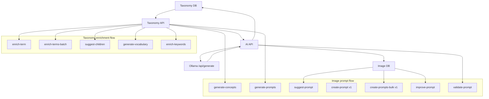
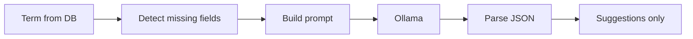
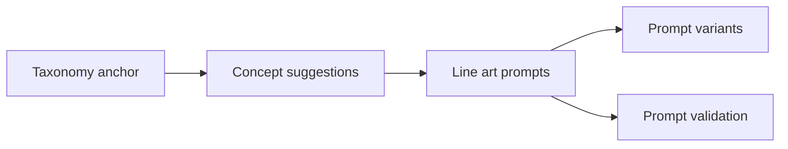
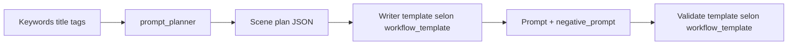

# Chaine IA: taxonomie -> enrichissement -> concepts -> prompts

Ce document décrit la chaine IA actuelle de l'application, depuis l'enrichissement de la taxonomie jusqu'a la generation de prompts image.

**Architecture** : depuis la migration "tout en jobs", toutes les routes `/api/ai/*` compute
renvoient HTTP 202 `{job_id, status, job_type}` et créent un job `pending` dans la table `job`.
L'exécution réelle est assurée par `AiPipelineWorker` (lancé par `scripts/run_text_worker.py`).
Le résultat est disponible dans `job.result` (artefact v1) une fois le job en `awaiting_validation`.

Voir aussi : `docs/cli-jobs-workflow.md` pour l'usage CLI et le polling.

Sources principales:
- `src/api/routes/ai.py` — routes enqueue (HTTP 202)
- `src/workers/ai_pipeline_worker.py` — exécution des jobs IA
- `src/services/ai_jobs_sync.py` — logique Ollama synchrone (utilisée par le worker)
- `src/api/routes/taxonomy.py`
- `prompts/taxonomy_prompts.yaml`
- `prompts/image_prompts.yaml`

## Vue globale



## Format technique de l'appel Ollama

Tous les endpoints IA passent par `_call_ollama()` dans `src/api/routes/ai.py`.

Payload HTTP envoye a Ollama:

```json
{
  "model": "<modele>",
  "prompt": "<prompt utilisateur final>",
  "system": "<prompt systeme final>",
  "stream": false,
  "options": {
    "temperature": 0.3
  }
}
```

Notes importantes:
- URL cible: `OLLAMA_BASE_URL + /api/generate`
- `stream = false`
- pas de `format = json`
- pour les modeles `qwen3`, le system prompt est prefixe par `/no_think`
- la reponse brute est reparsee via `_parse_json_response()`, qui retire les blocs `<think>` et tente de reparer certains JSON imparfaits

## 1. Chaine taxonomie

### Vue d'ensemble taxonomie



### 1.1 `/api/ai/enrich-term`

But:
- completer les champs manquants d'un terme
- ne rien appliquer automatiquement en base

Entree metier:
- `term_id`
- `vocabulary_id`
- `fields` optionnel
- `custom_system` / `custom_prompt` optionnels

Donnees injectees au prompt:
- `term_json`: terme complet au format API, sans `vocabulary_id`
- `missing_fields`: liste JSON des champs manquants ou explicitement demandes

Prompt systeme source:
- `prompts/taxonomy_prompts.yaml` -> `enrich_term.system`

Prompt utilisateur source:
- `prompts/taxonomy_prompts.yaml` -> `enrich_term.user`

Valeurs injectees:

```text
Existing taxonomy term (coloring website):
{term_json}

Fields to generate (only those listed here):
{missing_fields}
```

Exemple de valeur calculee:

```json
{
  "id": "birds",
  "slug": "birds",
  "parent_id": "animals",
  "name_fr": "Oiseaux",
  "name_en": "",
  "name_ar": "",
  "description_fr": "",
  "description_en": "",
  "description_ar": "",
  "weight": 2,
  "keywords": ["oiseau a colorier", "bird coloring"]
}
```

```json
["name_en", "name_ar", "description_fr", "description_en", "description_ar"]
```

Modele par defaut:
- `qwen2.5:7b`
- temperature `0.3`
- timeout taxonomy par defaut `600`

Sortie attendue:
- objet JSON plat contenant seulement les champs demandes

Sortie API:
- `suggestions`
- `fields_requested`
- `prompt_used`
- `model`
- `temperature`
- `raw_response`

### 1.2 `/api/ai/enrich-terms-batch`

But:
- enrichir plusieurs termes en un seul appel LLM

Donnees injectees:
- `terms_json`: objet `term_id -> term data`
- `missing_fields`: liste JSON triee et mutualisee pour le lot

Valeur utilisateur:

```text
Existing taxonomy terms (coloring website) — exact IDs to use as keys in your response:
{terms_json}

Fields to generate for EACH term (only those listed here):
{missing_fields}
```

Sortie attendue:
- objet JSON dont les cles sont exactement les `term_id`

Sortie API:
- `suggestions: {term_id: {field: value}}`
- `fields_requested`
- `term_ids`
- `prompt_used`

### 1.3 `/api/ai/suggest-children`

But:
- proposer de nouveaux sous-termes pour un parent

Donnees injectees:
- nom parent FR / EN
- `parent_id`
- `vocabulary_id`
- `existing_context`: soit la liste des enfants existants, soit un texte indiquant qu'il n'y en a pas
- `count`

Valeur utilisateur:

```text
Parent term: "{parent_name_en}" (FR: "{parent_name_fr}", ID: "{parent_id}")
Vocabulary: "{vocabulary_id}"
Context: children's and family coloring website

{existing_context}

Generate exactly {count} distinct, relevant and popular new child terms.
```

Particularite:
- si des enfants existent, le prompt leur passe une liste JSON explicite pour eviter les doublons

Sortie attendue:
- tableau JSON de termes enfants complets

Nettoyage cote API:
- `id` obligatoire
- `slug`, `name_fr`, `name_en`, `name_ar`, descriptions, `weight`, `parent_id`

### 1.4 `/api/ai/generate-vocabulary`

But:
- generer une structure de vocabulaire complete a partir d'un theme

Donnees injectees:
- `theme`
- `root_count`
- `children_per_root`

Valeur utilisateur:

```text
Generate a list of root terms for the theme: "{theme}"
Context: children's and family coloring website
Languages: French, English, Modern Standard Arabic (fusha/MSA)

Parameters:
- Number of root terms: {root_count}
- Number of child terms per root: {children_per_root}
```

Sortie attendue:
- objet ou tableau contenant des termes racines et leurs enfants

Sortie API:
- `theme`
- `suggestions`
- `prompt_used`

### 1.5 `/api/ai/enrich-keywords`

But:
- generer des mots-cles SEO multilingues pour un terme

Donnees injectees:
- `term_json`
- `min_keywords`
- `max_keywords`

Valeur utilisateur:

```text
Taxonomy term (coloring context):
{term_json}

Generate a list of SEO keywords for this term, considering the "coloring" context.
...
Target count: between {min_keywords} and {max_keywords} keywords total.
```

Sortie attendue:
- objet avec `keywords: []`

Sortie API:
- `existing_keywords`
- `suggestions`
- `prompt_used`

## 2. Chaine image: taxonomie -> concepts -> prompts

### Vue d'ensemble image



## 2.1 `/api/ai/generate-concepts`

But:
- proposer des concepts d'images a partir d'un theme
- optionnellement ancrer la generation sur une branche taxonomique

Donnees injectees:
- `theme`
- `count`
- `taxonomy_context`

Construction de `taxonomy_context`:
- si `term_id + vocabulary_id` sont fournis, l'API charge le parent et ses enfants directs
- sinon la chaine `"No taxonomy anchor provided."`

Valeur utilisateur:

```text
Theme: {theme}
{taxonomy_context}

Generate exactly {count} concepts (precise, drawable image ideas) for this theme.
```

Exemple de `taxonomy_context`:

```text
Taxonomy context (anchor) — parent term and existing children:
[
  {"id": "birds", "name_en": "Birds", "name_fr": "Oiseaux"},
  {"id": "birds_owl", "name_en": "Owls", "name_fr": "Hiboux"},
  {"id": "birds_parrot", "name_en": "Parrots", "name_fr": "Perroquets"}
]
```

Sortie nettoyee:
- `id`
- `slug`
- `title` = `name_en` ou `name_fr`
- `name_fr`
- `name_en`
- `name_ar`
- `description_fr`
- `description_en`
- `weight`

## 2.2 `/api/ai/generate-prompts`

But:
- transformer des concepts en prompts line art “legacy”

Entree:
- `concepts`
- ou `term_id + vocabulary_id/taxonomy_id`

Transformation cote API:
- si un terme taxonomique est fourni, l'API prend le terme parent + ses enfants comme concepts
- les concepts sont epures en `_slim_concept()` avant envoi au LLM

Format envoye:

```json
[
  {
    "id": "birds_owl",
    "title": "Owl in Forest",
    "title_fr": "Hibou dans la foret"
  }
]
```

Valeur utilisateur:

```text
Concepts to convert into line art prompts:
{concepts_json}

For EACH concept, generate {count} prompt(s).
```

La template impose:
- un `prompt`
- un `negative_prompt` fixe legacy

Sortie API:
- `suggestions: [{concept_id, prompt, negative_prompt}]`
- `concepts_count`
- `prompt_used`

## 2.3 `/api/ai/suggest-prompt`

But:
- suggerer des variantes ameliorees pour une image existante ou un prompt fourni

Sources de donnees:
- soit `image_id`
- soit `title + prompt + tags_context`

Si `image_id` est fourni:
- charge `title` et `prompt` depuis `image`
- charge les tags depuis `image_taxonomy_tag`
- tente de charger `title_en` si disponible

Valeur utilisateur:

```text
Image context:
- Title: {title}
- Current prompt: {prompt}
- Tags / theme: {tags_context}

The current prompt may be too generic. Generate {count} improved variant(s).
```

Sortie attendue:
- tableau JSON de suggestions

Sortie API:
- `suggestions: [{prompt, negative_prompt}]`
- `prompt_used`

## 3. Pipeline v1 planner -> writer -> validation

### Vue v1



Selection de templates (defaut Ernie) :
- corps optionnel `workflow_template` sur `create-prompt`, `create-prompts-bulk`, `improve-prompt`, `validate-prompt` et dans `config` des jobs `image_prompt_*`
- `z_image_turbo_v1` → `prompt_writer_zimage`, `validate_prompt_zimage`, `improve_prompt_zimage`
- absent, inconnu, ou `ernie-image-turbo-q8-api` → `prompt_writer_ernie`, `validate_prompt_ernie`, `improve_prompt_ernie`
- le planner reste toujours `prompt_planner` / `prompt_planner_batch`
- implementation : `resolve_image_prompt_template_keys` dans [src/api/routes/ai.py](../src/api/routes/ai.py) (parite avec [src/services/ai_jobs_sync.py](../src/services/ai_jobs_sync.py))

## 3.1 `/api/ai/create-prompt`

But:
- produire un prompt image v1 a partir de `keywords/title/tags_context`

Etape 1: planner
- template: `prompt_planner`
- sortie attendue: JSON unique avec
  - `subject`
  - `setting`
  - `props`
  - `composition`
  - `mood`
  - `constraints`

Valeur utilisateur du planner:

```text
Profile: {profile}
Keywords: {keywords}
Title hint: {title}
Tags / theme labels: {tags_context}

Produce ONE coherent scene plan.
```

Etape 2: writer
- template par defaut: `prompt_writer_ernie` ; si `workflow_template` = `z_image_turbo_v1` : `prompt_writer_zimage`
- entree: `plan_json`

Valeur utilisateur du writer:

```text
Scene plan (JSON — follow it faithfully):
{plan_json}

Write ONE continuous English prompt with this structure:
1) Opening sentence: composition + subject + setting + mood.
2) One paragraph: scene details using props from the plan
3) Style: ...
4) Technical cleanup: ...
```

Sortie attendue du writer:

```json
{
  "prompt": "...",
  "negative_prompt": "..."
}
```

Fallback metier:
- si `negative_prompt` est vide, l'API utilise `DEFAULT_LINEART_NEGATIVE_V1`

Valeur de fallback:

```text
shading, gradients, gray tones, shadows, color fills, watercolor, painting, photo, realistic, 3D render, blurry, low quality, text, watermark, signature
```

Sortie API:
- `prompt`
- `negative_prompt`
- `plan`
- `profile`
- `model_planner`
- `model_writer`
- `temperature_planner`
- `temperature_writer`
- `raw_plan`
- `raw_writer`

## 3.2 `/api/ai/create-prompts-bulk`

But:
- faire le meme pipeline v1 pour plusieurs items

Preparation des items:
- pour chaque item, si `image_id` est fourni:
  - complete `title` depuis la DB si absent
  - complete `tags_context` depuis les tags image si absent

Mode preferentiel:
1. `prompt_planner_batch` pour N items
2. writer en parallele (`prompt_writer_ernie` par defaut, ou `prompt_writer_zimage` si `workflow_template` = `z_image_turbo_v1`), semaphore `BULK_OLLAMA_CONCURRENCY = 3`
3. optionnellement validateur (`validate_prompt_ernie` ou `validate_prompt_zimage` selon la meme regle)

Repli:
- si le planner batch echoue, fallback sequentiel item par item via `create-prompt`

Valeur batch utilisateur:

```text
Items (JSON array — preserve order):
{items_json}

Return exactly {count} scene plan objects in one JSON array, one per item, same order as input.
```

Exemple de `items_json`:

```json
[
  {
    "index": 0,
    "profile": "kids_coloring_lineart_v1",
    "keywords": "tweety cave",
    "title": "Tweety Bird in a Cave",
    "tags_context": "oiseaux, grotte, looney tunes"
  }
]
```

Sortie API:
- `results[]` avec pour chaque ligne:
  - `ok`
  - `prompt`
  - `negative_prompt`
  - `plan`
  - `profile`
  - `model_planner`
  - `model_writer`
  - `temperature_planner`
  - `temperature_writer`
  - `validation` optionnelle

## 3.3 `/api/ai/improve-prompt`

But:
- produire des variantes de prompt a partir d'un prompt existant

Entree:
- `prompt`
- `title`
- `tags_context`
- ou `image_id`

Valeur utilisateur:

```text
Title: {title}
Current prompt: {prompt}
Tags / theme: {tags_context}

Generate exactly {count} improved variant(s) as a JSON array of objects with keys prompt and negative_prompt.
```

Sortie API:
- `suggestions: [{prompt, negative_prompt}]`
- `prompt_used`

## 3.4 `/api/ai/validate-prompt`

But:
- valider heuristiquement un prompt v1

Valeur utilisateur:

```text
Profile: {profile}
Prompt to validate:
---
{prompt}
---
```

Sortie attendue:

```json
{
  "score": 85,
  "checks": [
    {"id": "structure", "pass": true, "detail": "ok"}
  ],
  "recommendations": []
}
```

Sortie API:
- `score`
- `checks`
- `recommendations`
- `model`
- `temperature`
- `raw_response`

## 4. Origine des variables injectees

### Variables taxonomie

| Variable | Origine |
|---|---|
| `term_json` | `_get_term()` puis `json.dumps()` |
| `terms_json` | `body.term_ids` + `_get_terms_flat()` + `_term_to_response()` |
| `missing_fields` | `_detect_missing_fields()` ou `body.fields` |
| `existing_context` | `_get_term_children()` |
| `theme` | body API |
| `min_keywords`, `max_keywords` | body API |

### Variables image

| Variable | Origine |
|---|---|
| `taxonomy_context` | parent + enfants de la branche taxonomique |
| `concepts_json` | `_slim_concept()` |
| `title`, `prompt`, `tags_context` | body API ou DB `image` / `image_taxonomy_tag` |
| `profile` | body API, defaut `kids_coloring_lineart_v1` |
| `items_json` | lot prepare pour le planner batch |
| `plan_json` | sortie JSON du planner v1 |

## 5. Persistance et validation humaine

La plupart des endpoints IA:
- retournent des **suggestions**
- ne modifient pas directement la taxonomie ou les images
- exposent `prompt_used` et `raw_response` pour debug / review

Exceptions notables:
- la persistance finale depend ensuite d'autres endpoints UI/API
- pour la generation image, les prompts valides finissent generalement dans `image.prompt` et `image.negative_prompt` avant creation de job

## 6. Points faibles actuels de la chaine

### Taxonomie
- beaucoup de formats de sortie LLM sont tolérés, ce qui rend la pipeline robuste mais moins stricte
- les suggestions ne sont pas appliquees automatiquement, ce qui garde l'humain dans la boucle mais ralentit le flux

### Concepts / prompts
- il existe deux familles:
  - endpoints legacy (`generate_prompts`, `suggest_prompt`)
  - pipeline v1 (`create-prompt`, `create-prompts-bulk`, `improve-prompt`, `validate-prompt`)
- les prompts v1 peuvent devenir longs et verbeux, ce qui a un impact direct sur la generation image ensuite

### Technique
- les prompts systeme et utilisateur viennent de deux fichiers YAML distincts
- les templates taxonomie peuvent etre surcharges en DB, les templates image non
- la sortie JSON des LLM doit etre normalisee et reparée en post-traitement

## 7. Recommandations pour ameliorer la chaine de bout en bout

1. Unifier la terminologie entre taxonomie, concepts, images et workflow generation.
2. Definir des profils de prompts par workflow cible, pas seulement par usage UI.
3. Versionner explicitement les pipelines:
   - taxonomy v1
   - concept-to-prompt legacy
   - prompt pipeline v1
4. Conserver `prompt_used` et `raw_response`, mais ajouter des snapshots structurés par etape si besoin.
5. Mesurer:
   - longueur des prompts envoyes
   - taux d'echec JSON
   - taux d'acceptation humaine
   - taux de conversion prompt -> image generee

## 8. Resume executif

La chaine IA actuelle est composee de deux sous-systemes:
- une chaine **taxonomie SEO multilingue**:
  - enrichissement
  - batch enrich
  - suggestion d'enfants
  - generation de vocabulaire
  - enrichissement keywords
- une chaine **image / prompt line art**:
  - generation de concepts
  - generation legacy de prompts
  - suggestion de variantes
  - pipeline v1 planner -> writer -> validation

Le point central est `src/api/routes/ai.py`, qui:
- recupere les donnees depuis la DB
- hydrate les templates YAML
- appelle Ollama
- reparses les reponses JSON
- renvoie des suggestions structurées a l'UI et aux autres couches.
